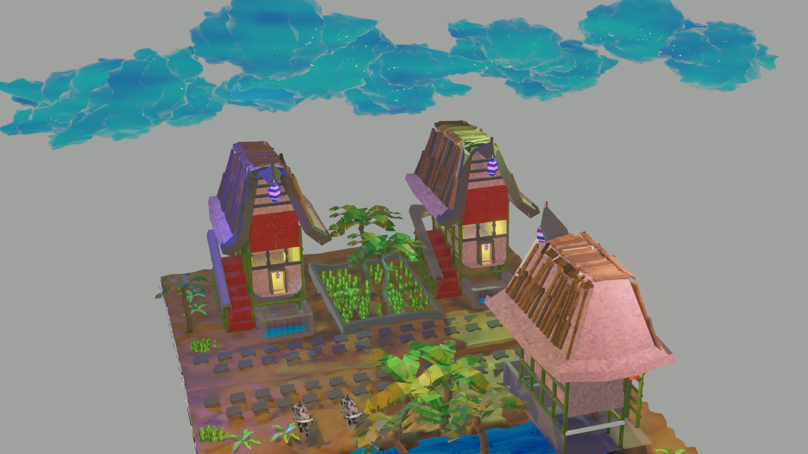

# enviromen-minature

# Miniature Environment Model

This repository contains a miniature environment model created using Blender. The model represents a detailed scene with various objects and elements, suitable for use in animations, games, visualizations, or any other 3D projects.

## Preview

Click on the image above to download the ZIP file containing the miniature environment model.

## Features

- Highly detailed 3D model of a miniature environment
- Realistic textures and materials
- Various objects, such as trees, buildings, rocks, etc.
- Customizable elements for further modifications

## Getting Started

To use the miniature environment model, follow these steps:

1. Download the ZIP file:
   - Click on the preview image above to download the ZIP file.
   - Extract the contents of the ZIP file to your desired location.

2. Open the Blender file:
   - Launch Blender on your local machine.
   - Navigate to the extracted folder of the miniature environment model.
   - Open the `model.blend` file in Blender.

3. Explore and customize:
   - Use the Blender interface to navigate and interact with the miniature environment.
   - Modify materials, textures, or objects as desired.
   - Adjust lighting or camera angles for different perspectives.

## License

The miniature environment model is released under the [MIT License](LICENSE).

## Credits

This miniature environment model was created by Aditya prajapati. If you use the model in your projects, attribution would be appreciated.

## Contributing

If you'd like to contribute to the development of this miniature environment model, you can follow these steps:

1. Fork the repository.
2. Create a new branch for your modifications.
3. Make the necessary changes and improvements.
4. Test your changes thoroughly.
5. Submit a pull request explaining the changes you've made.

Please ensure that your contributions align with the project's goals and adhere to the coding conventions.

## Feedback and Support

If you have any questions, suggestions, or issues, feel free to open an issue in the repository or contact Aditya prajapati at adityaprajapati1702@gmail.com

---

We hope you find this miniature environment model useful and enjoy working with it!

